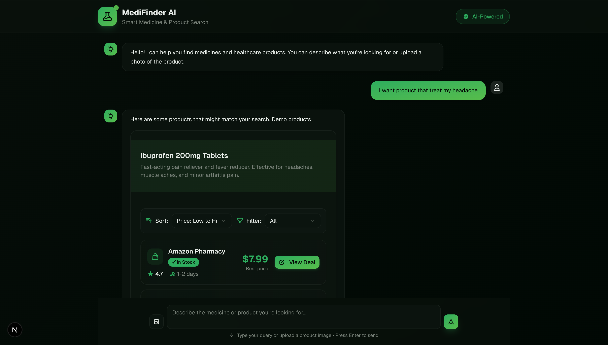
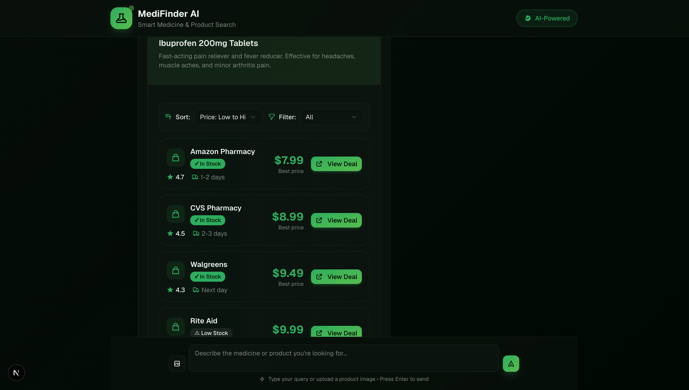

# 🧠 MediFinder AI  
### Smart Medicine & Product Search – AI-Powered Healthcare Assistant  

MediFinder AI is an intelligent web application designed to help users **identify medicines, find product alternatives, and compare prices across online retailers**.  
By combining **AI-powered natural language understanding**, **image recognition**, and **real-time data collection**, the system makes healthcare information more accessible, accurate, and user-friendly.  

---

## 🚀 Features  

- 🗣️ **AI-Powered Search** – Understands natural language queries like “find cheaper medicine for headache” using **OpenAI GPT models**.  
- 📸 **Image Recognition** – Upload a photo of a medicine box or prescription, and **Google Vision API** extracts relevant text (medicine name, dosage, etc.).  
- 🧬 **Entity Extraction** – Uses **Hugging Face NER models** to detect and normalize medical entities (drug names, ingredients, etc.).  
- 🛒 **Real-Time Price Comparison** – Retrieves product data and pricing from multiple online pharmacies using **SerpAPI Google Shopping Search**, avoiding bot detection issues from Selenium.  
- ☁️ **Full-Stack & Cloud-Ready** – Built with **React.js (frontend)** and **Django (backend)**, deployed on **AWS (EC2, Lambda, S3)** for scalability and performance.  

---

## 🧰 Tech Stack  

| Layer | Technologies |
|:------|:-------------|
| **Frontend** | React.js, TailwindCSS |
| **Backend** | Django REST Framework |
| **AI & ML** | OpenAI API (NLP), Google Vision API (OCR), Hugging Face (NER) |
| **Data Collection** | SerpAPI (Google Shopping Search), BeautifulSoup (initially with Selenium) |
| **Cloud & Infra** | AWS EC2, AWS Lambda, AWS S3 |
| **Database** | PostgreSQL / SQLite (development) |

---

## ⚙️ System Workflow  

1. **User Input** – User enters a natural-language query or uploads a product image.  
2. **NLP Processing (OpenAI)** – The query is interpreted and structured into search parameters.  
3. **OCR (Google Vision)** – Extracts text such as medicine names and dosages from uploaded images.  
4. **NER (Hugging Face)** – Recognizes and normalizes drug names and active ingredients.  
5. **Data Collection (SerpAPI)** – Fetches real-time pricing and product details from multiple retailers.  
6. **Display Results** – Medicines are displayed with details like price, availability, and delivery time.  

---

## 💡 Example Use Case  

**User input:**  
> “I want a product that treats my headache.”  

**System output:**  
> **Ibuprofen 200mg Tablets** – Fast-acting pain reliever and fever reducer.  

**Displayed results:**  
| Pharmacy | Price | Availability | Delivery |
|-----------|--------|---------------|-----------|
| Amazon Pharmacy | **$7.99** | In Stock | 1–2 days |
| CVS Pharmacy | **$8.99** | In Stock | 2–3 days |
| Walgreens | **$9.49** | In Stock | Next Day |
| Rite Aid | **$9.99** | Low Stock | — |

---
## DEMO 



--
## 🧠 AI Components Explained  

### **1. OpenAI API (Natural Language Understanding)**  
Interprets user queries, identifies intent, and generates structured search logic.  
> Example: “Find medicine for sore throat under 10 dollars” → Extracts key entities and price constraint.

### **2. Google Vision API (Computer Vision)**  
Performs **OCR (Optical Character Recognition)** to extract text and product info from images of medicine boxes or prescriptions.

### **3. Hugging Face Models (NER – Named Entity Recognition)**  
Recognizes and categorizes medical entities such as drug names, ingredients, and symptoms.  
> *Current challenge:* Model still returns sub-tokens (e.g., “Pan” + “##adol”), currently being fixed via post-processing.

### **4. SerpAPI Google Shopping (Web Scraping Alternative)**  
Replaces Selenium with an API-based approach for safe, stable data retrieval.  
```python
from serpapi import GoogleSearch
# Example
query = {"q": "buy paracetamol 500mg", "engine": "google_shopping"}

